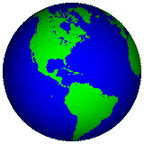

<!-- "Hero" Header -->

  
   
   
  
   
   

<!-- Social -->
<table width="100%" align="center">
<tr>
<td align="center">
<a href="https://www.linkedin.com/in/aman-kumar-b0424b188/">
<strong>Visit my LinkedIn Profile </strong>
 
 
 

</a>

</td>

<td align="center">
<a href="https://www.youtube.com/watch?v=uPD0QOGTmMI&ab_channel=TheWeekndVEVO">
<strong>Listen to cool music</strong>
 
 

 
</a>

</td>

</tr>
</table>

<!-- Footer -->

<!-- Badges -->

 

